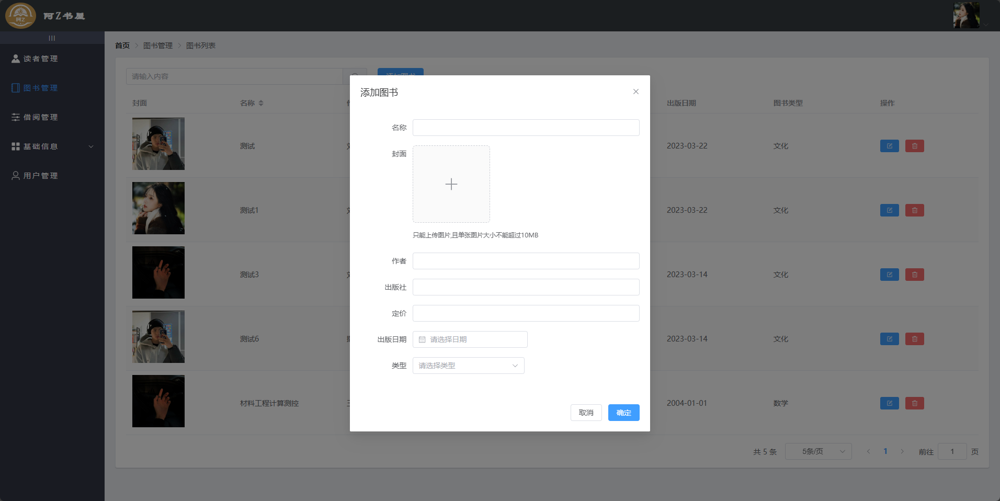
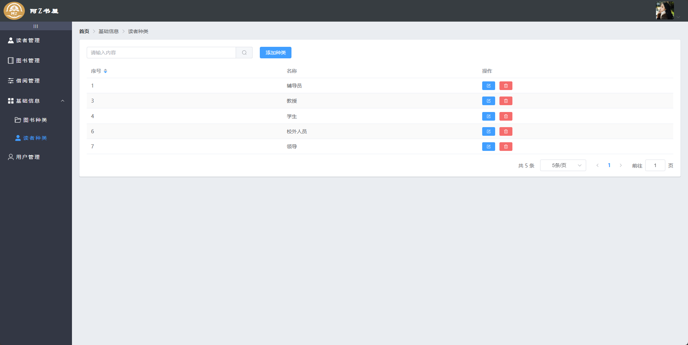

# 项目介绍
    本项目是一个简单的前后端分离的的图书管理系统-阿Z书屋

# 技术栈

## 前端技术

- Vue 3.0
- Element-Plus
- Router
- node
- Axios
- Vuex
- fullcalendar
- v-charts
- echarts
- luckysheet

## 后端技术
- Java 17
- SpringBoot 3.0
- Redis
- Spring-Security
- MyBatis-Plus
- MySQL
- Jwt

# 目录结构描述
    ├── bookmanage        // 后端项目

    │   ├── src     // src文件夹

    ├── bookmanage-vue    // 前端项目

    │   ├── src     // src文件夹

    └──  README.md         // 帮助文档

# 使用说明
##前端启动
    ```
    # 安装依赖
    pnpm install
    
    # 启动运行
    pnpm run seve
    ```
##后端配置
    ```
    # 数据库
    root:123456
    
    # redis密码
    redis
    ```

# 项目预览
1.登录页

2.读者管理




3.图书管理

4、借阅管理

5、图书种类管理

6、读者种类

7、用户管理


 
 